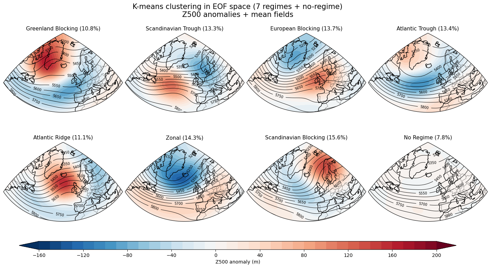
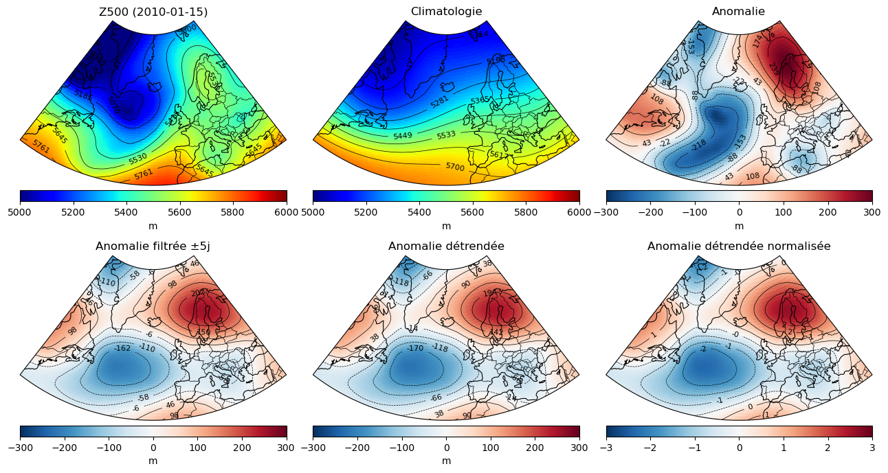
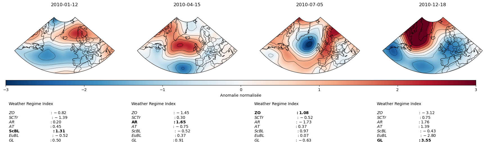
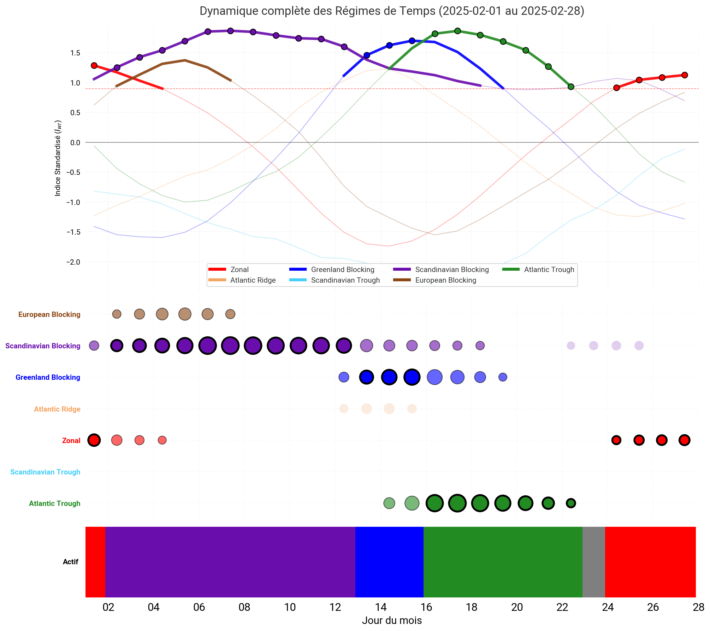
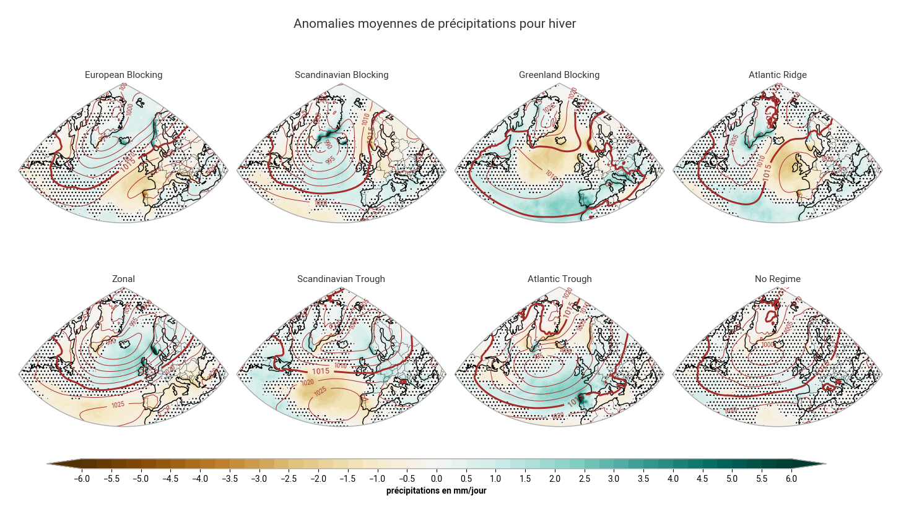
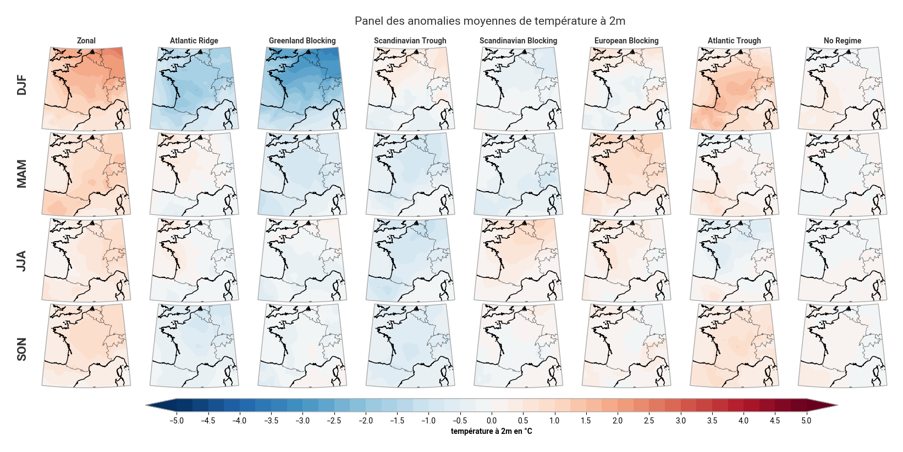
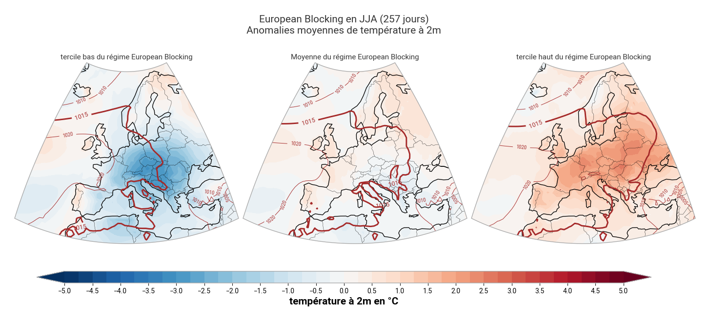
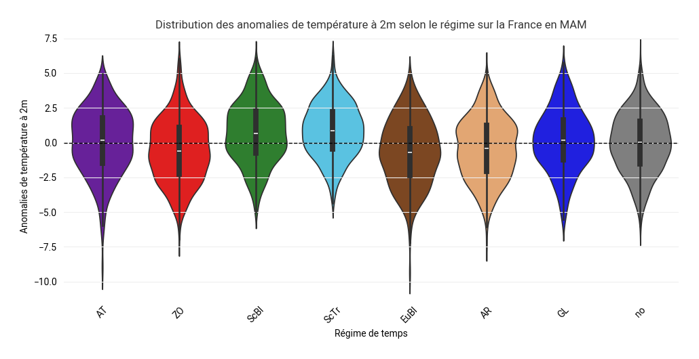

# Régimes de temps toute saison

## Description
L’objectif du projet est d’implémenter la méthode de calcul des régimes de temps « toutes saisons » sur l’Atlantique nord puis de faire un site web en temps réel de produits de suivi climatique et quotidien des régimes de temps toutes saisons. Le code est à disposition sur le git et voici le [lien du site](http://sotrtm38-sidev/~voisinl/menu.html) (disponible uniquement en interne pour l'instant).

## Installation
### Mise en place pour récupérer le git :

Nous utilisons **python 3.12.3** (utiliser pyenv pour changer de version si besoin)

1) Se placer dans un dossier racine sur votre machine et ouvrir un terminal (par exemple : Projet EMI)
2) Cloner le dépot git :

```
git clone https://github.com/EMI-weather-regime-project/Year-round-weather-regimes-monitoring.git
cd Year-round-weather-regimes-monitoring
```

3) Créer un environnement virtuel compatible (dans le dossier : regimes-de-temps-toutes-saisons)

Sous linux :

```
python3 -m venv .venv #créer l'environnement
source .venv/bin/activate #activer l'environnement
pip install -r requirements.txt #installer les librairies necessaires
```

## Arborescence
Après avoir cloné le dépot git, vous devriez avoir cette arborescence là : 
```

📁 Year-round-weather-regimes-monitoring/
├── 📄 README.md
├── 📄 requirements.txt
├── 📄 .gitignore
├── 📁 scripts/
│   ├── 📄 data_maker.py
│   ├── 📄 daily-tasks.py
│   ├── 📄 plotting_monitoring.py
│   ├── 📄 plotting_composites.py
│   ├── 📄 plotting_suivi_climatique.py
│   ├── 📄 recuperer_donnees_manuellement.py
│   ├── 📄 recuperer_nouvelles_donnees.py
│   └── 📁 donnees_sauvegardees/
├── 📁 data/
│   ├── 📁 climatologie/
│   └── 📁 donnees_quotidiennes/
│   │   ├── 📁 AnaCEP/
│   │   └── 📁 ERA5/
├── 📁 html/
│   ├── 📄 cartes_composites.html
│   ├── 📄 menu.html
│   ├── 📄 style.css
│   ├── 📄 suivi_climatique.html
│   └── 📄 suivi_quotidien.html
└── 📁 archives/
    ├── 📁 images_composites/
    ├── 📁 images_documentation/
    ├── 📁 images_suivi_climatique/
    └── 📁 images_monitoring/
        ├── 📁 AnaCEP/
        └── 📁 ERA5/
```

Pour récupérer les data qui doivent être placées dans le dossier data, il faut aller sur le Climate Data Store et prendre les fichiers suivants.


## Usage
Pour obtenir les images, voici les étapes à suivre : 
1) Récupérer les données et les mettre dans le dossier data
2) Lancer le fichier data_maker.py -> stock toutes les données utiles aux plots pour la suite dans le dossier donnees_sauvegardees. Pendant l'execution du script, une image va se créer dans le dossier donnees_sauvegardees avec les numeros de clusteurs. Pour répondre au quizz il faut se baser sur cette image. Vous pouvez avoir la solution en regardant l'image figure_cluster_inti.png dans le dossier images_documentation dans acrchives.
```
cd scripts
python3 data_maker.py
```
3) Lancer le fichier plotting_monitoring.py (long) -> permet de sauvegarder les graphiques mensuels et annuels des indices de régimes dans le dossier images_monitoring
```
python3 plotting_monitoring.py
```
4) Lancer le fichier plotting_composites.py (long) -> permet de sauvegarder l'ensemble des composites dans le dossier images_composites
```
python3 plotting_composites.py
```
Ce fichier nécessitant plusieurs heures à l'exécution, il est possible de l'exécuter en 3 fois. Pour cela, entrez la commande suivante dans le terminal : 
```
gedit plotting_composites.py
```
Puis, tout en bas du fichier, dans la section "Application des fonctions de production des figures", laissez décommentées (sans # en début de ligne) les lignes relatives aux figures que vous souhaitez générer, et commentez (ajoutez un # en début de ligne) le reste des lignes de la section. Par exemple, pour générer les terciles, ne mettez pas de # en début des trois premières lignes, mais ajoutez-en aux lignes suivantes. N'oubliez pas d'enregistrer vos modifications. Puis exécutez le programme avec la commande suivante :
```
python3 plotting_composites.py
```
Ré-exéctuez ces opérations autant de fois que nécessaire pour générer les figures. Nota bene : Vous pouvez exécuter les 9 dernières lignes d'un jet du fait de la rapidité de certaines fonctions !

5) Lancer le fichier plotting_suivi_climatique.py -> permet de sauvegarder les graphiques de suivi dans le dossier images_suivi_climatique
```
python3 plotting_suivi_climatique.py
```
Une fois que celui-ci à fini de tourner, si vous souhaitez avoir les histogrammes de suivi pour la période 1960-1990, exécuter la commande suivante :
```
gedit plotting_suivi_climatique.py
```
Puis tout en bas, dans la section "Génération des histogrammes" du fichier, commentez (ajoutez # devant la ligne) la ligne de sauvegarde relative à 1991-2025 et décommentez (enlevez le # devant la ligne) la ligne de sauvegarde relative à 1960-1990. Enregistrez les modifications et exécutez à nouveau la commande :
```
python3 plotting_suivi_climatique.py
```

Si vous êtes uniquement intéressé par la détermination des clusters et des indices de régime, le script qui vous est utile est data_maker.py

À ce moment là vous avez toutes les images sur la période 1960-2025, si vous souhaitez avoir le site en temps réel voici les étapes à suivre :

1) Bien vérifier que vous avez fait tourner suivi climatique jusqu'au bout, vous devriez avoir un fichier climatologie.npy dans votre dossier données_sauvegardées.


2) Les données les plus simples à récupérer sont celles d'ERA5. Tout d'abord, créez un fichier .cdsapirc dans le dossier Year-round-weather-regimes-monitoring :
```
touch .cdsapirc
```
Ensuite, vous devez créer un compte sur le Climate data store et l'activer. Puis, allez sur votre profil et ajoutez votre clé (que vous trouverez dans la section API key dans votre profil) dans le .cdsapirc et enregistrez vos modifications:
```
gedit .cdsapirc
```

3) Vous pouvez ensuite lancer le fichier recuperer_donnees_manuellement.py et choisir les dates manquantes (attention à cause du filtrage les 5 premiers jours seront effacés donc il est préférable de prendre large. Par exemple entrez 20251225 puis YYYYMMDD -5 Days pour avoir la date la plus récente une fois le script lancé. Vous devriez avoir les données qui s'enregistrent.
```
cd scripts
python3 recuperer_donnees_manuellement.py
```

4) Une fois cela fait, vous pouvez lancer daily-tasks.py --datatype ERA5
```
python3 daily-tasks.py --datatype ERA5
```

5) Si vous n'avez pas toutes les données, il faut modifier une ligne dans le script pour changer la date détectée (relativedelta(days=5)).


6) Ensuite le script recuperer_nouvelles_donnees.py permet d'avoir les données du jour et vous pouvez mettre un cron en place pour le faire tourner.

## Support
Si vous avez des questions, voici les personnes à contacter :
- oscar.lorans@meteo.fr
- killian.mounier@meteo.fr
- louis.voisin@meteo.fr
- margaux.verly@meteo.fr

## Roadmap
On a également intégré un suivi quotitien des régimes toutes saisons interne à Météo-France sur un site web.

## Contributing
Pour le moment le projet est fini et nous n'allons pas explorer plus loin.

## Authors and acknowledgment
Nos encadrants qui nous ont apporté une grande aide sur le projet :
- Frédéric Ferry
- Onaïa Savary
- Frédéric Gayrard
- Alexis Querin
- Julien Cattiaux
- Roland Amat-Boucq

## License
Vous êtes libre de reprendre notre code en nous mentionnant.

## Project status
Presque terminé

## Visuals
Depending on what you are making, it can be a good idea to include screenshots or even a video (you'll frequently see GIFs rather than actual videos). Tools like ttygif can help, but check out Asciinema for a more sophisticated method.


&nbsp;
------------------------------------------------------------------------------------------------------------------------------------------------------------------------------------------------------------------------
&nbsp;

&nbsp;
------------------------------------------------------------------------------------------------------------------------------------------------------------------------------------------------------------------------
&nbsp;

&nbsp;
------------------------------------------------------------------------------------------------------------------------------------------------------------------------------------------------------------------------
&nbsp;

&nbsp;
------------------------------------------------------------------------------------------------------------------------------------------------------------------------------------------------------------------------
&nbsp;

&nbsp;
------------------------------------------------------------------------------------------------------------------------------------------------------------------------------------------------------------------------
&nbsp;

&nbsp;
------------------------------------------------------------------------------------------------------------------------------------------------------------------------------------------------------------------------
&nbsp;

&nbsp;
------------------------------------------------------------------------------------------------------------------------------------------------------------------------------------------------------------------------
&nbsp;

&nbsp;
------------------------------------------------------------------------------------------------------------------------------------------------------------------------------------------------------------------------
